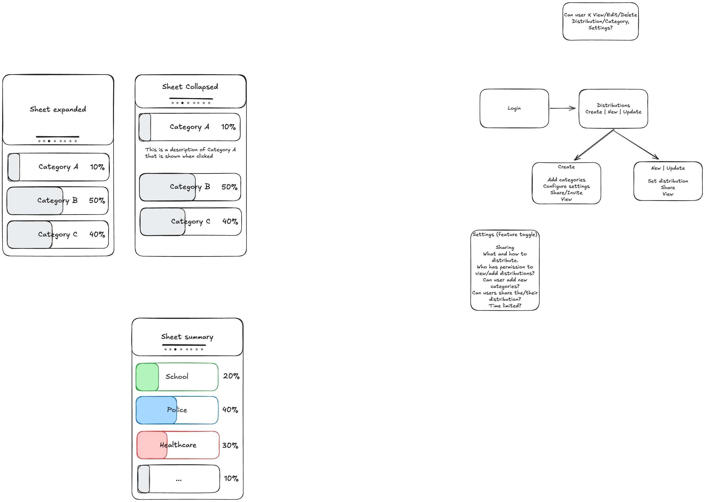

# Tax Distribution

A web application that empowers users to visualize and choose how their tax contributions should be distributed across different categories. Users can input their tax contributions, allocate percentages to various categories using interactive sliders, and view insights about how others are distributing their taxes and the aggregate distribution.

## Features

- **Tax Contribution Input**: Understand how you contribute to the tax system
- **Interactive Sliders**: Allocate tax distribution percentages across different categories
- **Real-time Insights**: View how other users are distributing their taxes
- **Aggregate Visualization**: See the collective distribution preferences
- **Mobile-First Design**: Optimized for mobile devices with touch interactions
- **Multi-Page Navigation**: Swipe through different sets of sliders and views

## Tech Stack

- **Frontend**: [Vite](https://vitejs.dev/) + [React](https://react.dev/)
- **Backend**: [Convex](https://docs.convex.dev/quickstart/react) - Real-time database and backend
- **Deployment**: [Vercel](https://vercel.com/)
- **Design**: Mobile-first responsive design

## Getting Started

### Prerequisites

- Node.js (v18 or higher)
- npm or yarn
- Convex account (for backend)

### Installation

```bash
# Install dependencies
npm install

# Set up Convex (if not already configured)
npx convex dev
```

### Development

```bash
# Start development server
npm run dev
```

## UI Components

### Body

The main content area of the application. It's a scrollable container that displays different sets of sliders for tax distribution categories.

### Pull-Down Sheet

A draggable sheet component that slides down from the top of the screen with two states:

- **Collapsed**: Shows a condensed view with minimal information
- **Expanded**: Displays detailed information and is vertically scrollable

**Features:**
- Horizontally scrollable in both states
- Swiping left/right navigates between different slider sets
- Handle bar at the bottom for drag-to-expand/collapse interaction
- Page indicator dots below the handle bar showing current page and total pages

### Slider

Interactive slider components used to set percentage values for tax distribution categories.

**Visual Design:**
- Horizontal rectangle with a draggable handle
- Outline indicates the full range
- Fill indicates the current value
- Category name displayed on the left
- Percentage value displayed on the right

**Interaction:**
- Click to expand and show category description below the slider
- View automatically scrolls to position expanded slider at the top
- Other sliders collapse and are pushed down when one expands
- Values are constrained so the sum of all sliders cannot exceed 100%

**TypeScript Interface:**

```typescript
interface SliderProperties {
    id: string;
    name: string; // e.g., "Healthcare"
    description: string; // e.g., "The current spend is X money per person per year"
    value: number; // e.g., 40
    max: number; // Constrains the value so that the sum of all sliders cannot be more than 100 (controlled by parent)
    color: string;
    onChange: (value: number) => void;
    onClick: (id: string) => void;
}
```

## UI Wireframe



## Project Structure

```
tax_distribution/
├── .cursor/
│   └── skills/          # Cursor AI skills and best practices
├── README.md            # Project documentation
└── ui.excalidraw.png    # UI wireframe design
```

## Contributing

Contributions are welcome! Please feel free to submit a Pull Request.

## License

[Add your license here]