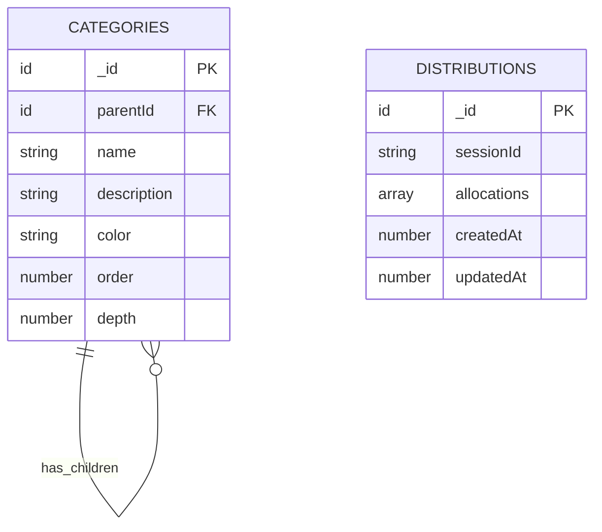
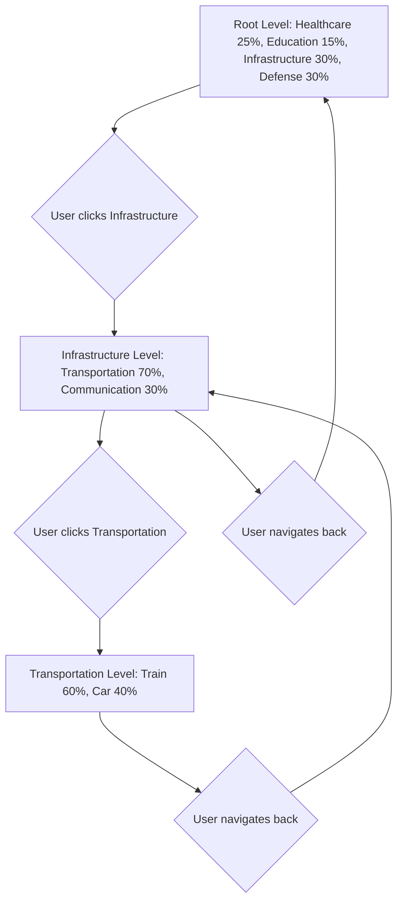

# Hierarchical Tax Distribution - Architecture Plan

## Requirements Summary (Confirmed)

- ✅ **Partial allocations allowed** - Users can stop at any level
- ✅ **User-suggested categories** - Users can propose new categories (future)
- ✅ **Unallocated percentages** - Not handled for now (future: aggregate distribution)
- ✅ **Expand button** - Separate button to drill down into sub-categories
- ✅ **Unlimited depth** - No maximum depth limit

## Overview

Transform the current flat category allocation system into a hierarchical tree structure where users can drill down into increasingly specific sub-categories. Each level must sum to 100%.

### Example Structure
```
1. Infrastructure: 30%
    1.1. Transportation: 70%
        1.1.1. Train: 60%
        1.1.2. Car: 40%
    1.2. Communication: 30%
        1.2.1. Fiber: 80%
        1.2.2. 5G: 20%
2. Culture: 70%
    2.1. Libraries: 50%
    2.2. Museums: 50%
```

---

## Current Architecture Analysis

### Current Schema ([`convex/schema.ts`](convex/schema.ts))
- **categories**: Flat structure with `name`, `description`, `color`, `order`, `page`
- **distributions**: Stores `sessionId` and flat array of `allocations` with `categoryId` and `percentage`

### Current Limitations
1. Categories are flat - no parent-child relationships
2. `page` field used for pagination, not hierarchy
3. Allocations only reference leaf categories
4. No validation that 100% is allocated at each level

---

## Proposed Solution

### Option A: Parent Reference Model (Recommended)

Add a `parentId` field to categories, creating a tree structure via self-referencing.



#### Pros
- Simple to understand and query
- Easy to add/remove categories
- Flexible depth - categories can have any number of levels
- Single query can fetch all categories, then build tree client-side

#### Cons
- Requires client-side tree building
- Deep nesting requires multiple lookups or denormalized depth field

### Option B: Path-Based Model

Store full path in each category like `/infrastructure/transportation/train`.

#### Pros
- Easy to query all children with prefix matching
- Path gives context about hierarchy

#### Cons
- Path must be updated when moving categories
- String manipulation required for queries
- More complex to maintain

### Recommendation: Option A with `depth` field

Use parent reference with a precomputed `depth` field for easier level-based queries.

---

## Schema Changes

### Updated [`convex/schema.ts`](convex/schema.ts)

```typescript
import { defineSchema, defineTable } from "convex/server";
import { v } from "convex/values";

export default defineSchema({
  // Hierarchical tax categories
  categories: defineTable({
    name: v.string(),
    description: v.string(),
    color: v.string(),
    order: v.number(),           // Display order within same parent
    parentId: v.optional(v.id("categories")), // null for root categories
    depth: v.number(),           // 0 for root, 1 for first level, etc.
    isLeaf: v.boolean(),         // true if no children
  })
    .index("by_parent", ["parentId"])
    .index("by_depth", ["depth"]),

  // User tax distributions
  distributions: defineTable({
    sessionId: v.string(),
    allocations: v.array(
      v.object({
        categoryId: v.id("categories"),
        percentage: v.number(),  // 0-100 within parent context
      })
    ),
    createdAt: v.number(),
    updatedAt: v.number(),
  }).index("by_session", ["sessionId"]),
});
```

### Key Changes
1. **Removed** `page` field - replaced by hierarchy
2. **Added** `parentId` - reference to parent category, null/undefined for roots
3. **Added** `depth` - precomputed depth for easier querying
4. **Added** `isLeaf` - indicates if category has children

---

## Data Model Details

### Sample Category Data
```javascript
// Root categories - depth 0
{ name: "Infrastructure", parentId: null, depth: 0, order: 0, isLeaf: false }
{ name: "Culture", parentId: null, depth: 0, order: 1, isLeaf: false }

// Second level - depth 1
{ name: "Transportation", parentId: infrastructure_id, depth: 1, order: 0, isLeaf: false }
{ name: "Communication", parentId: infrastructure_id, depth: 1, order: 1, isLeaf: true }
{ name: "Libraries", parentId: culture_id, depth: 1, order: 0, isLeaf: true }
{ name: "Museums", parentId: culture_id, depth: 1, order: 1, isLeaf: true }

// Third level - depth 2
{ name: "Train", parentId: transportation_id, depth: 2, order: 0, isLeaf: true }
{ name: "Car", parentId: transportation_id, depth: 2, order: 1, isLeaf: true }
```

### Allocation Storage Strategy

Allocations are stored for ALL levels, not just leaves:
```javascript
{
  sessionId: "abc123",
  allocations: [
    // Root level - must sum to 100%
    { categoryId: infrastructure_id, percentage: 30 },
    { categoryId: culture_id, percentage: 70 },
    
    // Infrastructure children - must sum to 100%
    { categoryId: transportation_id, percentage: 70 },
    { categoryId: communication_id, percentage: 30 },
    
    // Transportation children - must sum to 100%
    { categoryId: train_id, percentage: 60 },
    { categoryId: car_id, percentage: 40 },
    
    // Culture children - must sum to 100%
    { categoryId: libraries_id, percentage: 50 },
    { categoryId: museums_id, percentage: 50 },
  ]
}
```

### Computing Effective Percentage

To calculate the "effective" percentage of any category:

```typescript
function getEffectivePercentage(
  categoryId: string, 
  allocations: Map<string, number>,
  categories: Map<string, Category>
): number {
  const category = categories.get(categoryId);
  if (!category) return 0;
  
  const myPercentage = allocations.get(categoryId) ?? 0;
  
  if (!category.parentId) {
    // Root category - percentage is absolute
    return myPercentage;
  }
  
  // Multiply by parent's effective percentage
  const parentEffective = getEffectivePercentage(
    category.parentId, 
    allocations, 
    categories
  );
  
  return (myPercentage / 100) * parentEffective;
}

// Example: Train at 60% of Transportation at 70% of Infrastructure at 30%
// Effective = 0.60 * 0.70 * 0.30 = 0.126 = 12.6% of total budget
```

---

## UI/UX Design

### Navigation Flow



### Component Changes

#### 1. Updated [`Slider`](src/components/Slider.tsx) Component
- Add indicator showing if category has children
- Add "drill down" affordance/button
- Show effective percentage in tooltip

#### 2. Updated [`Body`](src/components/Body.tsx) Component
- Replace page-based navigation with hierarchical navigation
- Add breadcrumb showing current path
- Add back button when not at root
- Calculate per-level totals instead of global total

#### 3. New `Breadcrumb` Component
```
Home > Infrastructure > Transportation
```
Shows current navigation path with clickable ancestors.

### Wireframe Concept

```
┌─────────────────────────────────────────┐
│  ← Back                                 │
│  Infrastructure > Transportation        │  <- Breadcrumb
├─────────────────────────────────────────┤
│  ████████████████████░░░░░░░░  60%     │
│  Total allocated at this level          │
├─────────────────────────────────────────┤
│  ████████████████████████░░░░  60%     │
│  Train                           →      │  <- Arrow indicates children
├─────────────────────────────────────────┤
│  ████████████████░░░░░░░░░░░░  40%     │
│  Car                             →      │
└─────────────────────────────────────────┘
```

### User Interaction
1. **Drag slider** - Adjust percentage within current level
2. **Click category name/arrow** - Drill down into sub-categories
3. **Click back button** - Navigate up one level
4. **Click breadcrumb item** - Jump to any ancestor level

---

## Backend API Changes

### New Queries

#### `categories.getChildren`
```typescript
export const getChildren = query({
  args: { parentId: v.optional(v.id("categories")) },
  handler: async (ctx, args) => {
    return await ctx.db
      .query("categories")
      .withIndex("by_parent", q => 
        args.parentId 
          ? q.eq("parentId", args.parentId)
          : q.eq("parentId", undefined)
      )
      .collect();
  },
});
```

#### `categories.getPath`
```typescript
export const getPath = query({
  args: { categoryId: v.id("categories") },
  handler: async (ctx, args) => {
    const path: Category[] = [];
    let current = await ctx.db.get(args.categoryId);
    
    while (current) {
      path.unshift(current);
      current = current.parentId 
        ? await ctx.db.get(current.parentId) 
        : null;
    }
    
    return path;
  },
});
```

### Updated Mutations

#### `distributions.upsert`
Add validation to ensure allocations at each level sum to 100%:

```typescript
export const upsert = mutation({
  args: {
    sessionId: v.string(),
    allocations: v.array(allocationValidator),
  },
  handler: async (ctx, args) => {
    // Group allocations by parent
    const allocationsByParent = new Map<string | null, number[]>();
    
    for (const alloc of args.allocations) {
      const category = await ctx.db.get(alloc.categoryId);
      const parentKey = category?.parentId?.toString() ?? null;
      
      if (!allocationsByParent.has(parentKey)) {
        allocationsByParent.set(parentKey, []);
      }
      allocationsByParent.get(parentKey)!.push(alloc.percentage);
    }
    
    // Validate each level sums to 100%
    for (const [parentId, percentages] of allocationsByParent) {
      const sum = percentages.reduce((a, b) => a + b, 0);
      if (sum !== 100) {
        throw new ConvexError({
          code: "INVALID_ALLOCATION",
          message: `Allocations for parent ${parentId} must sum to 100%, got ${sum}%`,
        });
      }
    }
    
    // ... rest of save logic
  },
});
```

---

## Migration Strategy

### Phase 1: Schema Migration
1. Add new fields with defaults
2. Migrate existing flat categories to root level
3. Create example hierarchical sub-categories

### Phase 2: Backend Updates
1. Add new queries for tree traversal
2. Update validation logic
3. Maintain backward compatibility during transition

### Phase 3: Frontend Updates
1. Update Body component with breadcrumb
2. Add drill-down navigation
3. Update slider to show hierarchy indicators

### Phase 4: Seed Data
1. Create realistic hierarchical category tree
2. Include 2-3 levels of depth
3. Cover major government spending areas

---

## Validation Rules

1. **Root level** allocations must sum to exactly 100%
2. **Each parent's children** must sum to exactly 100% (when user allocates to that level)
3. **Individual percentages** must be 0-100
4. **All category IDs** must be valid
5. **Partial allocations**: User can allocate at root level without drilling down

---

## Edge Cases

### 1. User hasn't drilled down yet
- Only root-level allocations exist
- Sub-category allocations use defaults or are null

### 2. Category structure changes after user allocation
- Handle gracefully - orphaned allocations should be ignored
- Show warning to user about unallocated funds

### 3. Empty sub-categories
- Some categories may have no children (leaves)
- No drill-down available for leaves

---

## Technical Implementation Tasks

1. **Schema Update** - Modify `convex/schema.ts` with new fields
2. **Migration Script** - Create script to migrate existing data
3. **Backend Queries** - Add `getChildren`, `getPath`, `getTree` queries
4. **Validation Logic** - Update `distributions.upsert` with level validation
5. **Breadcrumb Component** - New React component for navigation
6. **Body Component Update** - Replace page navigation with tree navigation
7. **Slider Enhancement** - Add drill-down affordance
8. **Aggregate Calculation** - Update to handle effective percentages
9. **Seed Data** - Create realistic hierarchical categories
10. **Tests** - Unit tests for tree traversal and validation

---

## Questions for Clarification

1. **Should partial allocations be allowed?** Can a user allocate at root level without specifying sub-category breakdowns?

2. **Default behavior for unallocated sub-levels?** Should there be default distributions or should users be required to complete all levels?

3. **How deep should the hierarchy go?** Is there a maximum depth limit?

4. **Should we keep the page-based view as alternative?** Or fully replace with tree navigation?

5. **How should aggregates be displayed?** Show average at each level, or compute effective percentages?
